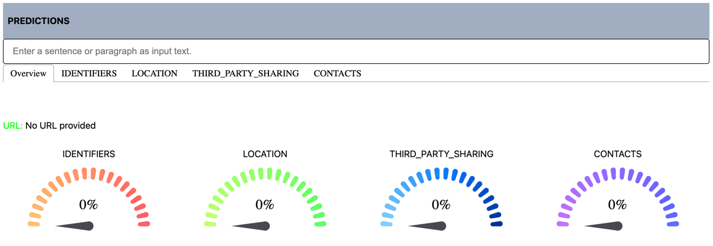
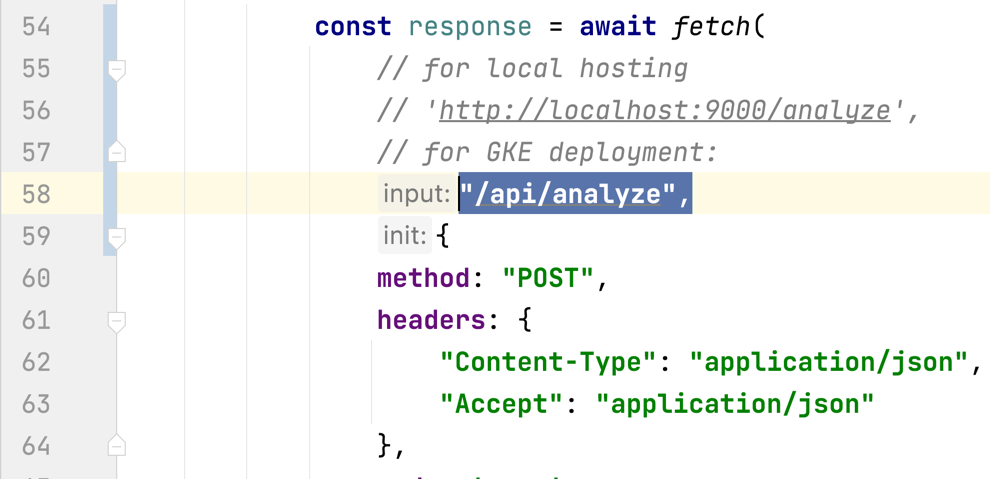
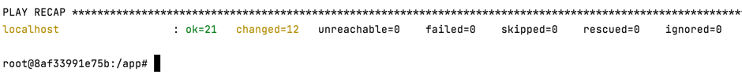
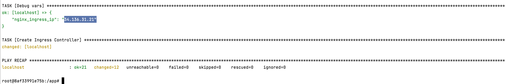
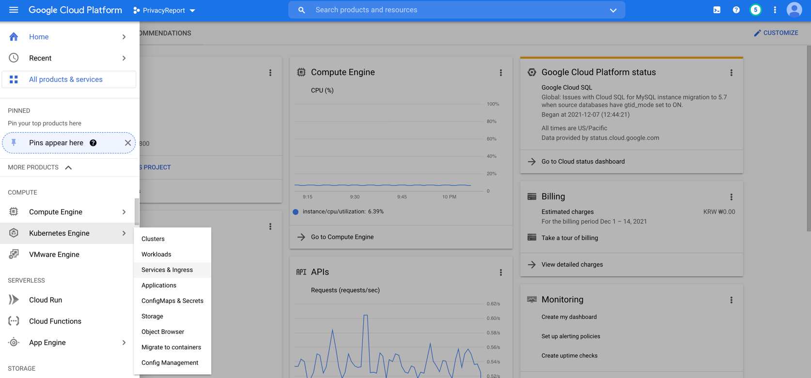
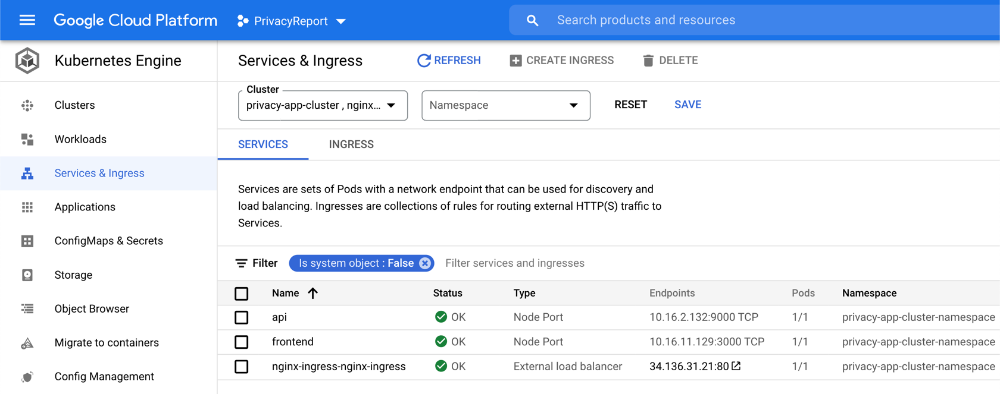

AC215-Privacy Policy Report Card
==============================

AC215 Fall 2021


Project Description
------------

The goal of this project is to build an application that will allow users to enter
the URL of a privacy policy, and receive a "report card" explaining which categories
of user data the application collects and shares.

Project Demo
------------

This tutorial will allow you to create a Kubernetes cluster on GCP with an API backend and a React frontend. You can see a [demo here](http://34.136.31.21.sslip.io/). 

Design Overview
------------

When a user submits a privacy policy to be graded, the app needs to take a number of steps to evaluate it
1. The front end accepts the user's input
    - The React front end takes the url as input, and passes it to an API running as a separate microservice
2. The API receives the URL request and passes it to the backend inference engine
3. The inference engine incorporates elements of the training data pipeline to fetch and parse the text of the privacy policy
4. The inference engine passes the encoded privacy policy to the model for inference
   - Our model is designed to detect the presence of language that indicates the collection of certain user data.
     It does this for each paragraph of the policy. Because a given paragraph may contain any combination of trackers,
     we have created a custom ensemble model to detect each tracker type as a binary response variable. 
4. The model completes its inferences and passes the result as a dictionary back to the API
5. The API returns model inferences as a JSON to the frontend.
6. The front end renders the model's output for the user to review


Project Organization and Key Components
------------

- Data : Stores raw training data

- Pipeline: Stores files for processing raw data into training sets                                             
    - Create_Unlabeled_Dataset.py -> scrapes the web for fine-tuning data                
    - Labeled_Data_Pipeline.py -> parses raw training data from APP350 into dataframe    
    - Training_Data_Pipeline.py -> encodes text data for training                        
- models: contains files for training and generating models  

- api-service: Contains files for serving the model as an API                                             
    - demo_app.py -> FastAPI module for serving model inferences                                               
    - `api-service/Back_End/Inference_Engine.py` -> builds ensemble model using Demo_Model_Weights           
                                                                                                   
- frontend-react: Contains files for the frontend as a web app
    - Todos.jsx -> React Component that calls the API using a URL as input and displays the response with visualizations                          
    - TabPanelMaker.jsx -> Creates a tab per category of analysis (IDENTIFIERS, LOCATION, 3RD_PARTY, CONTACTS, etc.)
      
--------

      .
      ├── deployment #conains files for configuring deployment to GCP GKE
      ├── api-service # conains files for the API backend prototype and demo
      ├── frontend-react #contains files for the frontend prototype and demo
      ├── models
      ├── notebooks
      │   ├── Fine Tuning Experiments
      ├── Pipeline
      │   ├── Labeled_Data_Pipeline.py #Creates training data from APP350 Dataset
      │   ├── Create_Unlabeled_Dataset.py #Creates fine-tuning data via web-scraping
      │   ├── Training_Data_Piepline.py #Encodes text data for training      │   ├── Fine Tuning Experiments
      ├── notebooks
      │   ├── Fine Tuning Experiments
      ├── submissions
      │   ├── Milestone_2_PrivacyPolicyReportCard
      │   ├── Milestone_4_PrivacyPolicyReportCard
      ├── LICENSE
      └── README.md

# Privacy App - Hosting Locally
This section describes how to run the Privacy App on your local machine using Docker containers. After these steps, you will have the Privacy App running locally via two Docker containers: the API service backend and the React frontend. Make sure you have Docker installed on your machine before you begin. 

## Getting started
First, clone this repository. Once that is done, there are two parts to running this app locally.
- Start the API service backend
- Start the React frontend

## Start the API service backend
The API service backend files are contained in the `/api-service` directory. Follow these steps to start the backend:
- Change directory to `/api-service`
```
cd api-service
```
- Run `sh docker-shell.sh` or `docker-shell.bat` for Windows
```
sh docker-shell.sh
```
This will host the API service on your local machine via port 9000. Go to "http://localhost:9000" to see the API service is running. 
Note that because we are using FastAPI, you can see the swagger documentation at "http://localhost:9000/docs" as well as the ReDoc version at "http://localhost:9000/redoc". 

## Start the React frontend
The React frontend files are contained in the `/frontend-react` directory. Follow these steps to start the frontend:
- Open the file `/frontend-react/scr/components/Todos.jsx`. Uncomment line 56 which says `"http://localhost:9000/analyze",`. This enables the frontend to speak to the locally hosted API service backend. Additionally, comment out line 58 which says `"/api/analyze",`. This line is used for allowing the frontend to call the API service in a GKE cluster.

- Change directory to `/frontend-react`
```
cd frontend-react
```
- Run `sh docker-shell.sh` or `docker-shell.bat` for Windows
```
sh docker-shell.sh
```
This will host the React frontend on your local machine via port 3000. At `localhost:3000`, you should see the following screen.


Now, your app is hosted locally and ready to start analyzing privacy policies!

---

# Privacy App - Deployment to GCP
This section describes how to deploy the containers to Google Container Registry. After the following steps, your containers will be pushed to Google Container Registry and ready to be served.


## Getting Started 
### Make sure the frontend is pointing to the correct URL
Before deploying to GCP, open `/frontend-react/src/components/Todos.jsx` and make sure line 56 is commented out and line 58 is uncommented. Line 56, which says `"http://localhost:9000/analyze",` is used for calling the API service when it is being served locally. We don't want to do this for GCP deployment. Line 58 which says `"/api/analyze",` is the correct URL for calling the API service in a GKE cluster, so make sure it is active before deploying. 

### Enable GCP APIs
To deploy to GCP, we need to enable access several APIs. Search for each of these in the GCP search bar and click enable to enable these APIs:
* Compute Engine API
* Service Usage API
* Cloud Resource Manager API
* Google Container Registry API

## Create a service account for deployment
- Go to [GCP Console](https://console.cloud.google.com/home/dashboard), search for  "Service accounts" from the top search box. or go to: "IAM & Admins" > "Service accounts" from the top-left menu and create a new service account called "deployment"
- Give the following roles:
- For `deployment`:
    - Compute Admin
    - Compute OS Login
    - Container Registry Service Agent
    - Kubernetes Engine Admin
    - Service Account User
    - Storage Admin
- Then click done.
- This will create a service account
- On the right "Actions" column click the vertical ... and select "Create key". A prompt for Create private key for "deployment" will appear select "JSON" and click create. This will download a Private key json file to your computer. Copy this json file into the **secrets** folder.
- Rename the json key file to `deployment.json`
- Follow the same process Create another service account called `gcp-service`
- For `gcp-service` give the following roles:
    - Storage Object Viewer
- Then click done.
- This will create a service account
- On the right "Actions" column click the vertical ... and select "Create key". A prompt for Create private key for "gcp-service" will appear select "JSON" and click create. This will download a Private key json file to your computer. Copy this json file into the **secrets** folder.
- Rename the json key file to `gcp-service.json`

## Setup Docker Container (Ansible, Docker, Kubernetes)
Rather than each of installing different tools for deployment we will use Docker to build and run a standard container will all required software.

### Start the `deployment` Docker Container
- cd into `deployment`
- Go into `docker-shell.sh` or `docker-shell.bat` and change `GCP_PROJECT` to your project id
- Run `sh docker-shell.sh` or `docker-shell.bat` for windows

Now you have a Docker container that connects to your GCP and call create VMs, deploy containers all from the command line

## SSH Setup
### Configuring OS Login for service account
```
gcloud compute project-info add-metadata --project <YOUR GCP_PROJECT> --metadata enable-oslogin=TRUE
```

### Create SSH key for service account
```
cd /secrets
ssh-keygen -f ssh-key-deployment
cd /app
```

### Providing public SSH keys to instances
```
gcloud compute os-login ssh-keys add --key-file=/secrets/ssh-key-deployment.pub
```
From the output of the above command keep note of the username. Here is a snippet of the output 
```
- accountId: ac215-project
    gid: '3906553998'
    homeDirectory: /home/sa_100110341521630214262
    name: users/deployment@ac215-project.iam.gserviceaccount.com/projects/ac215-project
    operatingSystemType: LINUX
    primary: true
    uid: '3906553998'
    username: sa_100110341521630214262
```
The username is `sa_100110341521630214262`


## Deployment Setup
* Add ansible user details in inventory.yml file
* GCP project details in inventory.yml file
* GCP Compute instance details in inventory.yml file

## Deployment

### Build and Push Docker Containers to GCR (Google Container Registry)
```
ansible-playbook deploy-docker-images.yml -i inventory.yml
```


------------

# Deploy to Kubernetes Cluster 

## Outline
1. Enable APIs in GCP
2. Start Deployment Docker Container
3. Start a GKE cluster and deploy containers

## Enable APIs in GCP
Search for each of these in the GCP search bar and click enable to enable these API's
* Compute Engine API
* Service Usage API
* Cloud Resource Manager API
* Google Container Registry API
* Kubernetes Engine API

## Start Deployment Docker Container
We will use the Docker container hosted in the `/deployment` directory. Follow these steps:
-  `cd deployment`
- Run `sh docker-shell.sh` or `docker-shell.bat` for windows

### Create & Deploy Cluster
Run the following command inside of the Deployment Docker container to start deploying to GKE:
```
ansible-playbook deploy-k8s-cluster.yml -i inventory.yml --extra-vars cluster_state=present
```

This takes several minutes. Be patient. Once it is deployed successfully you will see the following output. 


### If you want to shell into a container in a Pod
Use the following commands to access individual containers in the cluster:
```
kubectl get pods --namespace=privacy-app-cluster-namespace
kubectl get pod api-5d4878c545-47754 --namespace=privacy-app-cluster-namespace
kubectl exec --stdin --tty api-5d4878c545-47754 --namespace=privacy-app-cluster-namespace  -- /bin/bash
```

### View the App
You can access the hosted app by following the steps below
* Copy the `nginx_ingress_ip` from the terminal from the create cluster command

* Go to `http://<YOUR INGRESS IP>.sslip.io`

Note that after deploying the cluster successfully, it may still be a few minutes before your containers are up and running. If the Privacy App isn't working immediately after deployment, be patient. It should be working within ten minutes. 

### Check GCP for Deployment Status
If you want to see the status of your deployment, click on the Navigation Menu on the upper left corner in your GCP Dashboard. Go to "Kubernetes Engine > Services & Ingress". 


Here you can see the status of your cluster and its containers.

